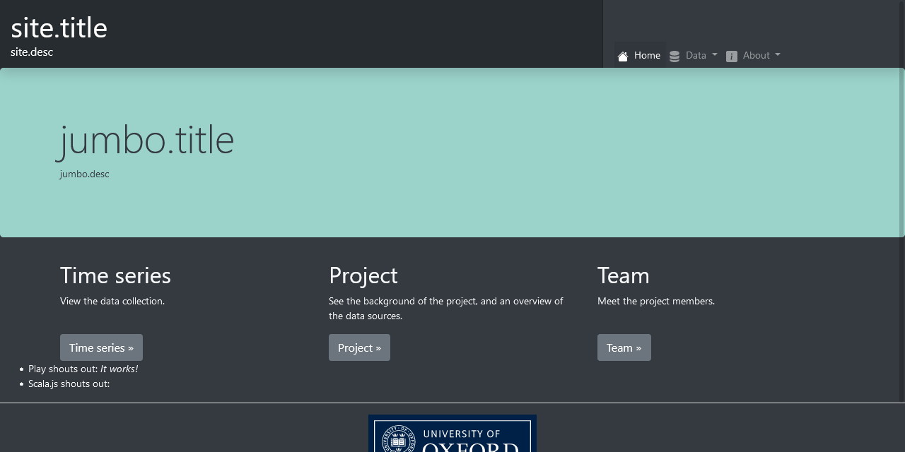

# graphing-app-scaffold

A Play Framework website for data visualisation.

The build supports Scala.js for frontend scripting, slick for database access, and scss compilation.

The project can be compiled with sbt, and produces a .deb install archive. This installs the webserver as a service that
requires a reverse-proxy such as nginx to be served on port 80 to the web.

No licenses are currently provided to redistribute the code, please contact the authors for a license if you wish to do so.
This site scaffold will be freely available shortly.

## Development environment
See [development.md](docs/development.md) for instructions on setting up a local development environment.
